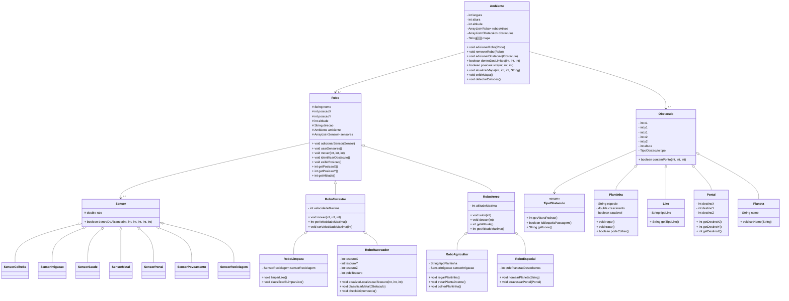

# 🚀 Laboratório 03 - MC322 - Programação Orientada a Objetos

**Autores:**  
- Anita Almeida - RA: 173273  
- Daniela Naves - RA: 281141  

**Versão do Java Utilizada:**  
- 21.0.5

**Ambiente de Desenvolvimento Integrado Utilizado:**  
- Visual Studio Code – versão 1.99

---

# 🤖 Simulador de Robôs

Este projeto em Java implementa um **simulador de robôs em um ambiente tridimensional** com diferentes tipos de robôs que interagem com obstáculos e realizam ações específicas.  
Cada robô possui características distintas — como coletar lixo, cuidar de plantas, encontrar tesouros e explorar planetas — e pode se mover por esse ambiente controlado, respeitando limites de movimentação e obstáculos como **lixo**, **plantas**, **tesouros** e **portais**.  
Cada robô possui sensores específicos para detectar ou interagir com esses elementos.

---

## 📁 Estrutura de Arquivos

| Arquivo                       | Descrição                                              |
|--------------------------------|--------------------------------------------------------|
| `Main.java`                   | Classe principal com testes e menu interativo          |
| `Ambiente.java`               | Gerencia robôs e obstáculos no ambiente 3D             |
| `Obstaculo.java`              | Classe base para obstáculos                           |
| `Plantinha.java`              | Obstáculo do tipo plantinha                            |
| `Lixo.java`                   | Obstáculo do tipo lixo                                 |
| `Portal.java`                 | Obstáculo do tipo portal de teletransporte             |
| `Planeta.java`                | Obstáculo do tipo planeta                             |
| `TipoObstaculo.java`          | Enumeração de tipos de obstáculos                     |
| `Robo.java`                   | Classe base para robôs                                |
| `RoboTerrestre.java`          | Robôs que se movem apenas no plano XY                  |
| `RoboAereo.java`              | Robôs que se movem em XYZ (incluindo altitude)         |
| `RoboLimpeza.java`            | Robô que coleta e classifica lixo                     |
| `RoboAgricultor.java`         | Robô que cuida e colhe plantinhas                     |
| `RoboEspacial.java`           | Robô que nomeia planetas e atravessa portais           |
| `RoboRastreador.java`         | Robô que localiza e identifica metais e tesouros       |
| `Sensor.java`                 | Classe base para sensores                             |
| `SensorColheita.java`         | Sensor que detecta plantinhas prontas para colheita    |
| `SensorIrrigacao.java`         | Sensor que detecta plantinhas que precisam de água     |
| `SensorSaude.java`            | Sensor que detecta plantinhas doentes                  |
| `SensorMetal.java`            | Sensor que detecta metais no ambiente                 |
| `SensorPortal.java`           | Sensor que detecta portais                            |
| `SensorPovoamento.java`       | Sensor que detecta se planetas estão povoados          |
| `SensorReciclagem.java`       | Sensor para identificar tipo de lixo para reciclagem   |

---

## 🧱 Diagrama de Classes

O seguinte diagrama mostra as principais classes do simulador, suas heranças, composições e métodos principais.



---

## ▶️ Como Executar

1. Compile todos os arquivos:
```bash
javac *.java
```

2. Execute a simulação:
```bash
java Main
```

---

# 🕹️ Menu Interativo

Após a execução, você poderá:

| Opção | Ação |
|------|------------------------------------|
| 1    | Mover um robô                      |
| 2    | Visualizar status dos robôs        |
| 3    | Visualizar o ambiente tridimensional |
| 4    | Usar sensores dos robôs            |
| 5    | Regar uma plantinha                |
| 6    | Tratar uma plantinha doente        |
| 7    | Colher uma plantinha               |
| 8    | Classificar e limpar lixo          |
| 9    | Nomear um planeta                  |
| 0    | Encerrar o simulador               |

**Observação:** As classes são instanciadas no início do programa. O menu apenas realiza interações.

---

# 🌍 Funcionamento do Ambiente

### 🧊 Estrutura Básica
- 🟦 Modelado como matriz 3D com:  
  • 📏 **Eixo X** (largura)  
  • 📐 **Eixo Y** (altura)  
  • 🪂 **Eixo Z** (altitude/profundidade)  

### 🏗️ Elementos no Espaço
- ⚠️ **Obstáculos** têm coordenadas fixas  
- 🤖 **Robôs** ocupam posições dinâmicas  
- 📍 Todos os objetos possuem posição (x, y, z) precisa  

---

# 🚦 Movimentação e Sistema de Coordenadas

### 📍 Como a movimentação ocorre:

- `deltaX > 0`: o robô tenta se mover para o **sentido positivo** de **X** (horizontal, direita)
- `deltaX < 0`: o robô se move para o **sentido negativo** de **X** (horizontal, esquerda)
- `deltaY > 0`: o robô desce no eixo **Y** (vertical, para baixo)
- `deltaY < 0`: o robô sobe no eixo **Y** (vertical, para cima)
- `deltaZ > 0`: o robô sobe no **eixo de altitude**
- `deltaZ < 0`: o robô desce no **eixo de altitude**

---

> **Importante:**  
> - A direção (Norte, Sul, etc.) é apenas decorativa e **não influencia** o movimento real dos robôs.  
> - A movimentação ocorre primeiro em X, depois em Y e, se necessário, em Z.

> **Sobre obstáculos:**  
> - Se encontrar um obstáculo ao mover-se em X, o movimento nesse eixo é cancelado, mas o robô tenta se mover no eixo Y e, se for um robô aéreo, também em Z.

---

# 🚦 Velocidade Máxima (Robôs Terrestres)

- Robôs terrestres possuem um limite de velocidade máxima nos eixos X e Y.
- Se o movimento desejado ultrapassar essa velocidade, o deslocamento é ajustado para o valor máximo permitido.

---

# ✈️ Altitude (Robôs Aéreos)

- Robôs aéreos controlam sua altitude usando métodos de **subir** ou **descer**.
- Respeitam limites:
  - Não ultrapassam a altitude máxima do robô
  - Não ultrapassam o teto do ambiente
  - Não podem ir abaixo do solo (altitude mínima = 0)

---

# 🧠 Ações Específicas por Tipo de Robô

| Robô            | Ações Especiais                                         | Sensores Utilizados                | Obstáculos Relacionados |
|-----------------|---------------------------------------------------------|-------------------------------------|--------------------------|
| `RoboLimpeza`   | Coleta e classifica lixo                                | `SensorReciclagem`                  | `Lixo`                   |
| `RoboAgricultor`| Rega, trata e colhe plantinhas                          | `SensorColheita`, `SensorIrrigacao`, `SensorSaude` | `Plantinha`            |
| `RoboRastreador`| Localiza tesouros e diferencia metais                   | `SensorMetal`                      | `Tesouro`, `Lixo`         |
| `RoboEspacial`  | Nomeia planetas e atravessa portais                     | `SensorPortal`, `SensorPovoamento`  | `Portal`, `Planeta`       |

---

# 🛰️ Ações Específicas por Tipo de Sensor

| Sensor | Função |
|:---|:---|
| `SensorColheita` | Detecta plantinhas maduras |
| `SensorIrrigacao` | Detecta plantinhas que precisam de água |
| `SensorSaude` | Detecta plantinhas doentes |
| `SensorMetal` | Detecta metais (tesouros e lixo) |
| `SensorPortal` | Detecta portais próximos |
| `SensorPovoamento` | Verifica se planetas são habitados |
| `SensorReciclagem` | Classifica o tipo de lixo encontrado |

---

# 🧱 Ações Específicas por Tipo de Obstáculo

| Obstáculo | Função no Ambiente | Relação com Robôs |
|:---|:---|:---|
| `Plantinha` | Pode ser regada, tratada e colhida | `RoboAgricultor` |
| `Lixo` | Pode ser classificado e removido | `RoboLimpeza`, `RoboRastreador` |
| `Portal` | Permite teletransporte entre pontos | `RoboEspacial` |
| `Planeta` | Pode ser nomeado e povoado | `RoboEspacial` |
| `Tesouro` | Pode ser encontrado | `RoboRastreador` |

---

# 📜 Licença

Projeto acadêmico — Universidade Estadual de Campinas — MC322 — 2025.

---
