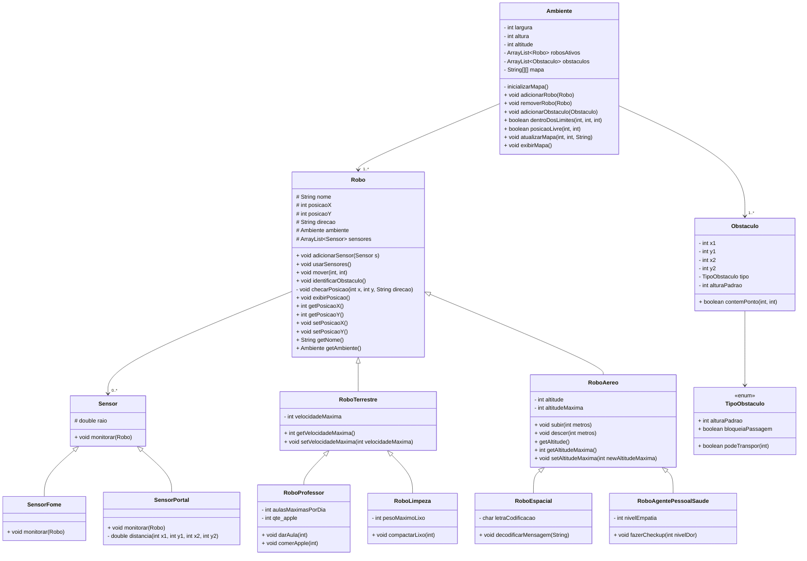

# Laboratório 03 - MC322 - Programação Orientada a Objetos
**Autores:** 
- Anita Almeida - RA: 173273
- Daniela Naves - RA: 281141

**Versão do Java Utilizada:**
- 21.0.5

**Ambiente de Desenvolvimento Integrado Utilizado:**
- Visual Studio Code

# 🤖 Simulador de Robôs

Este projeto em Java simula um ambiente bidimensional com diferentes tipos de robôs que interagem com obstáculos e realizam ações específicas. Cada robô possui características distintas — como capacidade de voo, empatia, ensino, coleta de lixo ou decodificação de mensagens — e pode se mover por esse ambiente controlado, respeitando limites de movimentação e obstáculos.

---

## 📁 Estrutura de Arquivos

| Arquivo                       | Descrição                                             |
|-------------------------------|-------------------------------------------------------|
| `Main.java`                   | Classe principal com simulações e testes              |
| `Ambiente.java`               | Define o ambiente (tamanho, obstáculos, robôs)        |
| `Obstaculo.java`              | Representa obstáculos fixos no ambiente               |
| `Robo.java`                   | Classe base para todos os robôs, com movimentação     |
| `RoboTerrestre.java`          | Robôs que se movem no plano com velocidade limitada   |
| `RoboAereo.java`              | Robôs com movimentação em X, Y e altitude             |
| `RoboLimpeza.java`            | Robô especializado em coleta e compactação de lixo    |
| `RoboProfessor.java`          | Robô capaz de dar aulas com limite diário             |
| `RoboAgentePessoalSaude.java` | Robô que avalia o nível de dor com base em empatia    |
| `RoboCientista.java`          | Robô que decodifica mensagens com base em letra-chave |

---

## 🧱 Diagrama de Classes

O seguinte diagrama mostra as principais classes do simulador, suas heranças, composições e métodos principais.



---

## ▶️ Como Executar

1. Compile todos os arquivos:
   ```bash
   javac -d bin src/mc322/Simulator/*.java
   ```

2. Execute a simulação:
   ```bash
   java -cp bin Main
   ```

---

## 🌍 Funcionamento do Ambiente

O ambiente é uma grade bidimensional composta por:

- **Posições livres**: representadas por `"_"`  
- **Robôs ativos**: representados por `"&"`  
- **Obstáculos**: representados por `"*"`  

O ambiente possui três dimensões:
- `largura` (X)
- `altura` (Y)
- `altitude` (Z, para robôs aéreos)

---

## 🤖 Regras de Movimentação

A movimentação é feita através do método `mover(int deltaX, int deltaY)`. Cada robô se move primeiro no eixo X e, em seguida, no eixo Y.

> **Importante:** O atributo `direcao` (como "Norte", "Sul", etc.) é **apenas decorativo** e **não influencia o movimento** real do robô.

### 🧭 Interpretação dos Parâmetros

- `deltaX > 0`: o robô tenta se mover para a **direita**
- `deltaX < 0`: o robô tenta se mover para a **esquerda**
- `deltaY > 0`: o robô tenta se mover para **baixo** (no eixo vertical)
- `deltaY < 0`: o robô tenta se mover para **cima**

### ⛔ Interação com Obstáculos

Se o robô encontrar um obstáculo no caminho, ele:
- Para imediatamente na posição anterior ao obstáculo
- Exibe uma mensagem informando a colisão

> **Importante:** Caso seja encontrado um obstaculo no eixo X, o robô encerra sua movimentação nesse eixo, mas inicia a movimentação no eixo Y, encerrando completamentamente a movimentação apenas após se mover no eixo Y também.

---

## 🚦 Velocidade Máxima (aplicável aos robôs terrestres)

A classe `RoboTerrestre` limita a movimentação com base na `velocidadeMaxima`.  
Se `|deltaX|` ou `|deltaY|` forem maiores que a velocidade máxima, o movimento será ajustado para o valor permitido, mantendo o mesmo sentido.

---

## ✈️ Altitude (aplicável aos robôs aéreos)

Robôs aéreos (`RoboAereo`, `RoboCientista`, `RoboAgentePessoalSaude`) também possuem altitude, que pode ser ajustada com:

- `subir(int metros)`
- `descer(int metros)`

A altitude respeita os seguintes limites:
- Não pode ultrapassar a `altitudeMaxima` do robô
- Nem a `altitude` máxima do ambiente
- Não pode ser menor que 0 (o solo)

---

## 🧠 Ações Específicas por Tipo de Robô

| Classe                   | Método Especial       | Função                                      |
|--------------------------|-----------------------|---------------------------------------------|
| `RoboLimpeza`            | `compactarLixo(peso)` | Compacta lixo até um limite máximo          |
| `RoboProfessor`          | `darAula(qtd)`        | Dá aulas, respeitando um número máximo      |
|                          |                            por dia                                  |
| `RoboAgentePessoalSaude` | `fazerCheckup(nivelDor)` | Responde com empatia ao nível de dor     |
|                          |                                informado                            | 
| `RoboCientista`          | `decodificarMensagem(msg)` | Remove uma letra específica da mensagem| 
|                          |                                codificada                           |

> **Importante:** A classe `RoboCientista` estende `RoboAereo` e representa um robô especializado em decodificação de mensagens. Além das funcionalidades herdadas, ele possui um atributo `letraCodificacao`, que define o caractere a ser removido das mensagens criptografadas. O método `decodificarMensagem(String mensagemCodificada)` exibe uma mensagem simulando o processo de decodificação e remove a letra codificada da string recebida.

> Uma limitação dessa abordagem de decodificação é que ela simplesmente remove todas as ocorrências da letra codificada da mensagem, sem considerar o contexto ou um padrão mais sofisticado de substituição. Por exemplo, se a mensagem original for "papagaio" e a letra de codificação for 'p', o resultado será "aagaio", o que pode tornar a mensagem difícil de interpretar ou até mesmo irreconhecível, especialmente se palavras diferentes compartilharem a mesma letra codificada.

---

## 🔍 Funções Auxiliares

Todos os robôs podem:
- Exibir sua posição atual com `exibirPosicao()`
- Identificar obstáculos ao redor com `identificarObstaculo()`
