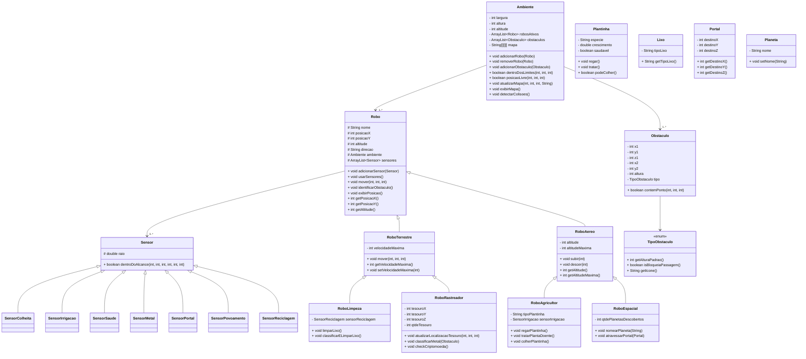

# 🚀 Laboratório 03 - MC322 - Programação Orientada a Objetos
**Autores:** 
- Anita Almeida - RA: 173273
- Daniela Naves - RA: 281141

**Versão do Java Utilizada:**
- 21.0.5

**Ambiente de Desenvolvimento Integrado Utilizado:**
- Visual Studio Code -> versão 1.99

# 🤖 Simulador de Robôs

Este projeto em Java implementa um **simulador de robôs em um ambiente tridimensional** com diferentes tipos de robôs que interagem com obstáculos e realizam ações específicas. Cada robô possui características distintas - coletar lixo, cuidar de plantas, encontrar tesouros e explorar planetas - e pode se mover por esse ambiente controlado, respeitando limites de movimentação e obstáculos como **lixo**, **plantas**, **tesouros** e **portais**. Cada robô possui sensores específicos para detectar ou interagir com esses elementos.

---

## 📁 Estrutura de Arquivos

| Arquivo                       | Descrição                                              |
|--------------------------------|--------------------------------------------------------|
| `Main.java`                   | Classe principal com testes e menu interativo          |
| `Ambiente.java`               | Gerencia robôs e obstáculos no ambiente 3D             |
| `Obstaculo.java`              | Classe base para obstáculos                           |
| `Plantinha.java`              | Obstáculo do tipo plantinha                            |
| `Lixo.java`                   | Obstáculo do tipo lixo                                 |
| `Portal.java`                 | Obstáculo do tipo portal de teletransporte             |
| `Planeta.java`                | Obstáculo do tipo planeta                             |
| `TipoObstaculo.java`          | Enumeração de tipos de obstáculos                     |
| `Robo.java`                   | Classe base para robôs                                |
| `RoboTerrestre.java`          | Robôs que se movem apenas no plano XY                  |
| `RoboAereo.java`              | Robôs que se movem em XYZ (altitude incluída)          |
| `RoboLimpeza.java`            | Robô que coleta e classifica lixo                     |
| `RoboAgricultor.java`         | Robô que cuida e colhe plantinhas                     |
| `RoboEspacial.java`           | Robô que nomeia planetas e atravessa portais           |
| `RoboRastreador.java`         | Robô que localiza e identifica metais e tesouros       |
| `Sensor.java`                 | Classe base para sensores                             |
| `SensorColheita.java`         | Sensor que detecta plantinhas prontas para colheita    |
| `SensorIrrigacao.java`         | Sensor que detecta plantinhas que precisam de água     |
| `SensorSaude.java`            | Sensor que detecta plantinhas doentes                  |
| `SensorMetal.java`            | Sensor que detecta metais no ambiente                 |
| `SensorPortal.java`           | Sensor que detecta portais                            |
| `SensorPovoamento.java`       | Sensor que detecta se planetas estão povoados          |
| `SensorReciclagem.java`       | Sensor para identificar tipo de lixo para reciclagem   |


---

## 🧱 Diagrama de Classes

O seguinte diagrama mostra as principais classes do simulador, suas heranças, composições e métodos principais.



---

## ▶️ Como Executar

1. Compile todos os arquivos:
   ```bash
   javac -d bin src/mc322/simulator/*.java
   ```

2. Execute a simulação:
   ```bash
   java -cp bin Main
   ```

---
## � Menu Interativo

Após a execução, você poderá:

| Opção | Ação                          |
|-------|-------------------------------|
| 1     | Mover um robô                 |
| 2     | Visualizar status dos robôs   |
| 3     | Visualizar o ambiente tridimensional |
| 4     | Usar sensores dos robôs       |
| 5     | Regar uma plantinha           |
| 6     | Tratar uma plantinha doente   |
| 7     | Colher uma plantinha          |
| 8     | Classificar e limpar lixo     |
| 9     | Nomear um planeta             |
| 0     | Encerrar o simulador          |

**Observação:** As classes são todas instanciadas no início do programa. O menu serve apenas para realizar as interações.

---

## 🌍 Funcionamento do Ambiente

### 🧊 Estrutura Básica
- 🟦 Modelado como matriz 3D com:  
  • 📏 **Eixo X** (largura)  
  • 📐 **Eixo Y** (altura)  
  • 🪂 **Eixo Z** (altitude/profundidade)  

### 🏗️ Elementos no Espaço
- ⚠️ **Obstáculos** têm coordenadas fixas  
- 🤖 **Robôs** ocupam posições dinâmicas  
- 📍 Todos os objetos têm localização (x,y,z) precisa  

### 🚦 Movimentação
- 🔄 Cada robô se move conforme:  
  - ✅ Capacidades técnicas  
  - 🛑 Restrições ambientais  
  - 📶 Eixos habilitados (terrestres: X,Y | aéreos: X,Y,Z)

---

## 🤖 Regras de Movimentação

A movimentação é feita através do método `mover(int deltaX, int deltaY, int deltaZ)`. Cada robô se move primeiro no eixo X, em seguida, no eixo Y e, por fim, no eixo Z.

> **Importante:** O atributo `direcao` (como "Norte", "Sul", etc.) é **apenas decorativo** e **não influencia o movimento** real do robô.

### 🧭 Interpretação dos Parâmetros

O ambiente é bem entendido em um sistema de coordenadas x,y,z. Na qual defini-se o eixo z, como o produto vetorial x por y. Este ambiente é representado por uma matriz "cúbica".

- `deltaX > 0`: o robô tenta se mover para o **sentido positivo** de **X** (Horizontal)
- `deltaX < 0`: o robô tenta se mover para a o **sentido negativo** de **X**
- `deltaY > 0`: o robô tenta se mover para o **sentido positivo** de **Y** (Vertical)
- `deltaY < 0`: o robô tenta se mover para **sentido negativo** de **Y**
- `deltaZ > 0`: o robô tenta se mover para o **sentido positivo** de **Z** (Altitude)
- `deltaZ < 0`: o robô tenta se mover para **sentido negativo** de **Z**

### ⛔ Interação com Obstáculos

Se o robô encontrar um obstáculo no caminho, ele:
- Para imediatamente na posição anterior ao obstáculo
- Exibe uma mensagem informando a colisão

> **Importante:** Caso seja encontrado um obstaculo no eixo X, o robô encerra sua movimentação nesse eixo, mas inicia a movimentação no eixo Y, encerrando completamentamente a movimentação apenas após se mover no eixo Y também. Comportamento análogo, é observado no eixo Z. 

---

## 🚦 Velocidade Máxima (aplicável aos robôs terrestres)

A classe `RoboTerrestre` limita a movimentação com base na `velocidadeMaxima`.  
Se `|deltaX|` ou `|deltaY|` forem maiores que a velocidade máxima, o movimento será ajustado para o valor permitido, mantendo o mesmo sentido.

---

## ✈️ Altitude (aplicável aos robôs aéreos)

Robôs aéreos (`RoboAereo`, `RoboEspacial`, `RoboAgricultor`) também possuem altitude, que pode ser ajustada com:

- `subir(int metros)`
- `descer(int metros)`

A altitude respeita os seguintes limites:
- Não pode ultrapassar a `altitudeMaxima` do robô
- Nem a `altitude` máxima do ambiente
- Não pode ser menor que 0 (o solo)

---

## 🧠 Ações Específicas por Tipo de Robô

| Classe Robô           | Método Especial                                      |
|----------------|-----------------------------------------------------|
| RoboLimpeza    | Detecta e classifica tipos de lixo (papel, plástico, vidro, metal, orgânico) |
| RoboAgricultor | Irriga, trata e colhe plantinhas específicas        |
| RoboRastreador | Detecta tesouros e diferencia metais                |
| RoboEspacial   | Nomeia planetas e atravessa portais                 |

---
## 📚 Regras Gerais

1. **Movimentação**
   - Terrestres: Velocidade máxima limitada
   - Aéreos: Altitude controlada (limites ambientais e técnicos)

2. **Sensores**  
   Alcance limitado para detecção de:  
   • Obstáculos • Plantas • Lixo  
   • Tesouros • Portais

3. **Obstáculos**  
   Parada imediata no eixo de colisão
---