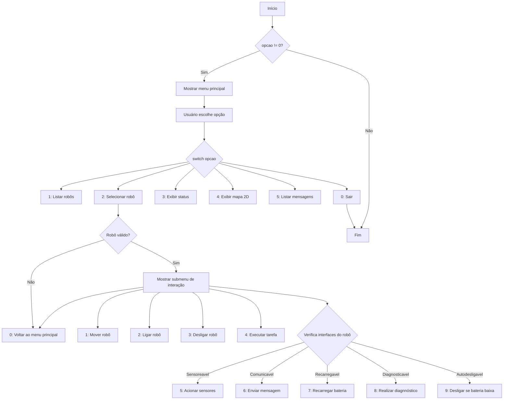

# 🚀 Laboratório 03 - MC322 - Programação Orientada a Objetos

**Autores:**  
- Anita Almeida - RA: 173273  
- Daniela Naves - RA: 281141  

**Versão do Java Utilizada:**  
- 21.0.5

**Ambiente de Desenvolvimento Integrado Utilizado:**  
- Visual Studio Code – versão 1.99

---

# 🤖 Simulador de Robôs

Este projeto em Java implementa um **simulador de robôs em um ambiente tridimensional** com diferentes tipos de robôs que interagem com obstáculos e realizam ações específicas.  
Cada robô possui características distintas — como coletar lixo, cuidar de plantas, encontrar tesouros e explorar planetas — e pode se mover por esse ambiente controlado, respeitando limites de movimentação e obstáculos como **lixo**, **plantas**, **tesouros** e **portais**.  
Cada robô possui sensores específicos para detectar ou interagir com esses elementos.

---

## 🎮 Menu Interativo 


---

## 📁 Estrutura de Arquivos

| 📦 Arquivo                                 | 📝 Descrição                                                                 |
|-------------------------------------------|------------------------------------------------------------------------------|
| `Main.java`                               | Classe principal com menu de interação com o ambiente                       |
|                                           |                                                                              |
| 🎮 Robôs                                                                        |
| `Robo.java`                               | Classe abstrata base de todos os robôs                                      |
| `RoboTerrestre.java`                      | Robô que se movimenta no plano XY                                           |
| `RoboAereo.java`                          | Robô que pode se movimentar na altitude                                     |
| `RoboAgricultor.java`                     | Robô que interage com plantinhas                                            |
| `RoboLimpeza.java`                        | Robô que coleta e classifica lixo                                           |
| `RoboRastreador.java`                     | Robô que detecta tesouros e metais                                          |
| `RoboEspacial.java`                       | Robô que descobre e nomeia planetas via portais                             |
|                                           |
| 🌐 Ambiente                                                                      |
| `Ambiente.java`                           | Classe que representa o ambiente 3D e gerencia o mapa e interações          |
|                                           |
| 🪨 Obstáculos                                                                   |
| `Obstaculo.java`                          | Classe base para obstáculos                                                 |
| `TipoObstaculo.java`                      | Enumeração de tipos de obstáculos                                           |
| `TipoEntidade.java`                       | Enumeração de tipos de entidade (robôs, obstáculos, etc)                    |
| `Lixo.java`                               | Obstáculo do tipo lixo                                                      |
| `Portal.java`                             | Obstáculo do tipo portal de teletransporte                                  |
| `Planeta.java`                            | Obstáculo do tipo planeta espacial                                          |
| `Plantinha.java`                          | Obstáculo do tipo plantinha com crescimento e estados                       |
| `Tesouro.java`                          | Obstáculo do tipo tesouro                       |
|                                           |
| 🔍 Sensores                                                                     |
| `Sensor.java`                             | Classe base de todos os sensores                                            |
| `SensorColheita.java`                     | Detecta plantinhas prontas para colheita                                    |
| `SensorIrrigacao.java`                    | Detecta plantinhas que precisam de água                                     |
| `SensorSaude.java`                        | Detecta plantinhas doentes                                                  |
| `SensorReciclagem.java`                   | Detecta tipo de lixo para separação correta                                 |
| `SensorMetal.java`                        | Detecta metais no ambiente                                                  |
| `SensorTesouro.java`                      | Detecta tesouros no ambiente                                                |
| `SensorPortal.java`                       | Detecta portais próximos                                                    |
| `SensorPovoamento.java`                   | Detecta planetas habitáveis                                                 |
|                                           |
| 📑 Interfaces                                                                   |
| `Sensoreavel.java`                        | Interface para robôs que utilizam sensores                                 |
| `Comunicavel.java`                        | Interface para robôs que se comunicam entre si                             |
| `Autodesligavel.java`                     | Interface para robôs que desligam sozinhos ao esgotar bateria              |
| `Recarregavel.java`                       | Interface para robôs que podem ser recarregados                            |
| `Diagnosticavel.java`                     | Interface para robôs que realizam diagnóstico                              |
|                                           |
| ⚠️ Exceções                                                                     |
| `CrescimentoMaximoAtingidoException.java` | Lançada quando plantinha chega ao máximo de crescimento                     |
| `ErroComunicacaoException.java`           | Lançada quando há falha de comunicação entre robôs                         |
| `ForaDosLimitesException.java`            | Lançada quando robô tenta ir para fora do ambiente                         |
| `ColisaoException.java`                   | Lançada quando duas entidades tentam ocupar a mesma posição                |
| `RoboDesligadoException.java`             | Lançada quando se tenta usar um robô desligado                             |

---

## 🧱 Diagrama de Classes

O seguinte diagrama mostra as principais classes do simulador, suas heranças, composições e métodos principais.

```mermaid
classDiagram

class Ambiente {
  - int largura
  - int altura
  - int altitude
  - ArrayList~Robo~ robosAtivos
  - ArrayList~Obstaculo~ obstaculos
  - String[][][] mapa
  + void inicializarMapa()
  + void adicionarRobo(Robo)
  + void removerRobo(Robo)
  + void adicionarObstaculo(Obstaculo)
  + boolean dentroDosLimites(int, int, int)
  + boolean posicaoLivre(int, int, int)
  + void atualizarMapa(int, int, int, String)
  + void exibirMapa()
  + void exibirPlanoXMapa(int)
  + void detectarColisoes()
  + int getAmbienteLargura()
  + int getAmbienteAltura()
  + int getAmbienteAltitude()
  + String[][][] getMapa()
  + ArrayList<Obstaculo> getObstaculos()
}

class Robo {
  # String nome
  # int posicaoX
  # int posicaoY
  # int altitude
  # String direcao
  # Ambiente ambiente
  # ArrayList~Sensor~ sensores
  + void adicionarSensor(Sensor)
  + void usarSensores()
  + void mover(int, int, int)
  + void identificarObstaculo()
  + void exibirPosicao()
  + int getPosicaoX()
  + int getPosicaoY()
  + int getAltitude()
}

class RoboTerrestre {
  - int velocidadeMaxima
  + void mover(int, int, int)
  + int getVelocidadeMaxima()
  + void setVelocidadeMaxima(int)
}

class RoboAereo {
  - int altitudeMaxima
  + void subir(int)
  + void descer(int)
  + int getAltitude()
  + int getAltitudeMaxima()
}

class RoboLimpeza {
  - SensorReciclagem sensorReciclagem
  + void limparLixo()
  + void classificarELimparLixo()
}

class RoboAgricultor {
  - String tipoPlantinha
  - SensorIrrigacao sensorIrrigacao
  + void regarPlantinha()
  + void tratarPlantaDoente()
  + void colherPlantinha()
}

class RoboEspacial {
  - int qtdePlanetasDescobertos
  + void nomearPlaneta(String)
  + void atravessarPortal(Portal)
}

class RoboRastreador {
  - int tesouroX
  - int tesouroY
  - int tesouroZ
  - int qtdeTesouro
  + void atualizarLocalizacaoTesouro(int, int, int)
  + void classificarMetal(Obstaculo)
  + void checkCriptomoeda()
}

class Obstaculo {
  - int x1
  - int y1
  - int z1
  - int x2
  - int y2
  - int altura
  - TipoObstaculo tipo
  + boolean contemPonto(int, int, int)
}

class Plantinha {
  - String especie
  - double crescimento
  - boolean saudavel
  + void regar()
  + void tratar()
  + boolean podeColher()
  + String getEspecie()
  + double getCrescimento()
  + boolean isSaudavel()
}

class Lixo {
  - String tipoLixo
  + String getTipoLixo()
  + void setTipoLixo(String)
}

class Portal {
  - int destinoX
  - int destinoY
  - int destinoZ
  + int getDestinoX()
  + int getDestinoY()
  + int getDestinoZ()
}

class Planeta {
  - String nome
  + void setNome(String)
  + String getNome()
}

class TipoObstaculo {
  <<enum>>
  + int getAlturaPadrao()
  + boolean isBloqueiaPassagem()
  + String getIcone()
}

class Sensor {
  # double raio
  + boolean dentroDoAlcance(int, int, int, int, int, int)
}

class SensorColheita {
  + void monitorar(Robo)
  + Plantinha checarColheita(Robo)
}

class SensorIrrigacao {
  + void monitorar(Robo)
  + Plantinha checarIrrigacao(Robo)
}

class SensorSaude {
  + void monitorar(Robo)
  + Plantinha checkup(Robo)
}

class SensorMetal {
  + void monitorar(Robo)
  + Obstaculo detectorTesouros(Robo)
}

class SensorPortal {
  + void monitorar(Robo)
  + Portal checarPortal(Robo)
}

class SensorPovoamento {
  + void monitorar(Robo)
  + Planeta checkPovo(Robo)
  + boolean planetaJaPovoado(Ambiente, Planeta)
}

class SensorReciclagem {
  - int lixoX
  - int lixoY
  - int lixoZ
  + void monitorar(Robo)
  + String classificarLixo(Obstaculo)
}

Ambiente --> "1..*" Robo
Ambiente --> "1..*" Obstaculo
Robo --> "0..*" Sensor
Obstaculo --> TipoObstaculo

Robo <|-- RoboTerrestre
Robo <|-- RoboAereo
RoboTerrestre <|-- RoboLimpeza
RoboTerrestre <|-- RoboRastreador
RoboAereo <|-- RoboAgricultor
RoboAereo <|-- RoboEspacial

Obstaculo <|-- Plantinha
Obstaculo <|-- Lixo
Obstaculo <|-- Portal
Obstaculo <|-- Planeta

Sensor <|-- SensorColheita
Sensor <|-- SensorIrrigacao
Sensor <|-- SensorSaude
Sensor <|-- SensorMetal
Sensor <|-- SensorPortal
Sensor <|-- SensorPovoamento
Sensor <|-- SensorReciclagem
```



---

## ▶️ Como Executar

1. Compile todos os arquivos:
```bash
javac -d bin src/mc322/simulator/*.java
```

2. Execute a simulação:
```bash
java -cp bin Main
```

---

# 🌍 Funcionamento do Ambiente

### 🧊 Estrutura Básica
- 🟦 Modelado como matriz 3D com:  
  • 📏 **Eixo X** (largura)  
  • 📐 **Eixo Y** (altura)  
  • 🪂 **Eixo Z** (altitude/profundidade)  

### 🏗️ Elementos no Espaço
- ⚠️ **Obstáculos** têm coordenadas fixas  
- 🤖 **Robôs** ocupam posições dinâmicas  
- 📍 Todos os objetos possuem posição (x, y, z) precisa  

---

# 🚦 Movimentação e Sistema de Coordenadas

### 📍 Como a movimentação ocorre:

- `deltaX > 0`: o robô tenta se mover para o **sentido positivo** de **X** (horizontal, direita)
- `deltaX < 0`: o robô se move para o **sentido negativo** de **X** (horizontal, esquerda)
- `deltaY > 0`: o robô desce no eixo **Y** (vertical, para baixo)
- `deltaY < 0`: o robô sobe no eixo **Y** (vertical, para cima)
- `deltaZ > 0`: o robô sobe no **eixo de altitude**
- `deltaZ < 0`: o robô desce no **eixo de altitude**

---

> **Importante:**  
> - A direção (Norte, Sul, etc.) é apenas decorativa e **não influencia** o movimento real dos robôs.  
> - A movimentação ocorre primeiro em X, depois em Y e, se necessário, em Z.

> **Sobre obstáculos:**  
> - Se encontrar um obstáculo ao mover-se em X, o movimento nesse eixo é cancelado, mas o robô tenta se mover no eixo Y e, se for um robô aéreo, também em Z.

---

# 🚦 Velocidade Máxima (Robôs Terrestres)

- Robôs terrestres possuem um limite de velocidade máxima nos eixos X e Y.
- Se o movimento desejado ultrapassar essa velocidade, o deslocamento é ajustado para o valor máximo permitido.

---

# ✈️ Altitude (Robôs Aéreos)

- Robôs aéreos controlam sua altitude usando métodos de **subir** ou **descer**.
- Respeitam limites:
  - Não ultrapassam a altitude máxima do robô
  - Não ultrapassam o teto do ambiente
  - Não podem ir abaixo do solo (altitude mínima = 0)

---

# 🧠 Ações Específicas por Tipo de Robô

| Robô            | Ações Especiais                                         | Sensores Utilizados                | Obstáculos Relacionados |
|-----------------|---------------------------------------------------------|-------------------------------------|--------------------------|
| `RoboLimpeza`   | Coleta e classifica lixo                                | `SensorReciclagem`                  | `Lixo`                   |
| `RoboAgricultor`| Rega, trata e colhe plantinhas                          | `SensorColheita`, `SensorIrrigacao`, `SensorSaude` | `Plantinha`            |
| `RoboRastreador`| Localiza tesouros e diferencia metais                   | `SensorMetal`                      | `Tesouro`, `Lixo`         |
| `RoboEspacial`  | Nomeia planetas e atravessa portais                     | `SensorPortal`, `SensorPovoamento`  | `Portal`, `Planeta`       |

---

# 🛰️ Ações Específicas por Tipo de Sensor

| Sensor | Função |
|:---|:---|
| `SensorColheita` | Detecta plantinhas maduras |
| `SensorIrrigacao` | Detecta plantinhas que precisam de água |
| `SensorSaude` | Detecta plantinhas doentes |
| `SensorMetal` | Detecta metais (tesouros e lixo) |
| `SensorPortal` | Detecta portais próximos |
| `SensorPovoamento` | Verifica se planetas são habitados |
| `SensorReciclagem` | Classifica o tipo de lixo encontrado |

---

# 🧱 Ações Específicas por Tipo de Obstáculo

| Obstáculo | Função no Ambiente | Relação com Robôs |
|:---|:---|:---|
| `Plantinha` | Pode ser regada, tratada e colhida | `RoboAgricultor` |
| `Lixo` | Pode ser classificado e removido | `RoboLimpeza`, `RoboRastreador` |
| `Portal` | Permite teletransporte entre pontos | `RoboEspacial` |
| `Planeta` | Pode ser nomeado e povoado | `RoboEspacial` |
| `Tesouro` | Pode ser encontrado | `RoboRastreador` |

---

# 📜 Licença

Projeto acadêmico — Universidade Estadual de Campinas — MC322 — 2025.

---
